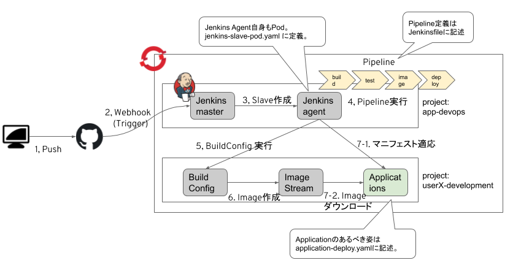

# 20230201ワークショップ
## 概要


## 事前準備
### Jenkinsの構築 (管理者向け)
ワークショップ管理者向けのJenkins構築設定.
また、利用者分のPodで利用するPVCの事前作成が必要。

```
$ oc new-project app-devops
$ oc new-app jenkins-persistent --param ENABLE_OAUTH=true --param MEMORY_LIMIT=8Gi --param VOLUME_CAPACITY=20Gi --param DISABLE_ADMINISTRATIVE_MONITORS=true
...
--> Success
    Access your application via route 'jenkins-app-devops.apps.na311.openshift.opentlc.com'
    Run 'oc status' to view your app.


$ for i in `seq 1 10`
 do
   oc new-project user$i-development
   oc policy add-role-to-user edit system:serviceaccount:app-devops:jenkins -n user$i-development
   oc policy add-role-to-user edit user$i -n app-devops
 done

$ oc process -f openshift/custom-jenkins-agent.yaml | oc apply -n app-devops -f -
buildconfig.build.openshift.io/custom-jenkins-agent-maven created
imagestream.image.openshift.io/custom-jenkins-agent-maven created

$ oc start-build custom-jenkins-agent-maven -n app-devops
```

### レポジトリのフォーク
Githubで[このレポジトリ](https://gitlab.apps.cluster-mf7f2.mf7f2.sandbox1686.opentlc.com/cicd-ws/openshift-pipeline-practice-java)をフォークし、自分のアカウントにレポジトリをコピーしましょう。
また1箇所変更が必要です。Jenkinsfileの13行目を自分のプロジェクト名に変更しましょう。

```
$ vim Jenkinsfile
    deploy_project = "userX-development"
```

## Jenkinsへのアクセス
Jenkinsへアクセスできるか確認しましょう。

- URL: https://jenkins-app-devops.apps.cluster-mf7f2.mf7f2.sandbox1686.opentlc.com
- ID/PW: Gitlabのアカウントです

## Jenkins Job作成
アプリケーションのパイプラインを実行するためにJenkins Itemを作成する。

1. "New Item"を選択
1. Itemの種類は"Pipeline"を選択し、`userX-job`の名前をつける。わかりやすいようにユーザ名を先頭に付けてください。
1. "Build Triggers"項目で"Generic Webhook Trigger"にチェックを付け下記を設定する
    - token: 任意の文字列(他の人とかぶらないようにユーザ名を含めてください。)
1. "Pipeline"の項目で実行するパイプライン定義を設定する
    - "pipeline script from SCM"を選択
    - SCMに"Git"を選択
    - Repository URLにはフォークした自分のレポジトリのURLを入力
    - Branches to buildは`*/main`を入力
    - これでSave

## GitレポジトリへWebhook設定
お使いのGitレポジトリへWebhookの設定を行う。
Generic Webhook Triggerの場合下記のURLでトリガーできる。

```
https://jenkins-app-devops.apps.cluster-mf7f2.mf7f2.sandbox1686.opentlc.com/generic-webhook-trigger/invoke?token=<your-token>
```


## パイプライン実行
ここまでできたらパイプラインを実行すれば、アプリケーションがデプロイされる。
アプリケーションの変更にも自動でデプロイできる状態だ。
レポジトリに任意の変更を加えてみよう。


## 動作確認
パイプラインが正常に終了すれば、みなさんの専用の環境でアプリケーションが起動している状態になります。  

`http://pipeline-practice-java-userX-development.apps.cluster-mf7f2.mf7f2.sandbox1686.opentlc.com` からアクセスできます。
Curlでもブラウザでもアクセス可能です。

```
$ curl pipeline-practice-java-user1-development.apps.cluster-mf7f2.mf7f2.sandbox1686.opentlc.com/hello
{
  "foo": "bar",
  "hello": "world"
}

$ curl pipeline-practice-java-user1-development.apps.cluster-mf7f2.mf7f2.sandbox1686.opentlc.com/freelancers
[
  {
    "freelancerId": "1",
    "firstName": "Ken",
    "lastName": "Yasuda",
    "email": "ken.yasuda@example.com",
    "skills": [
      "ruby",
      "php",
      "mysql"
    ]
  },
  {
    "freelancerId": "2",
    "firstName": "Tadashi",
    "lastName": "Komiya",
    "email": "tadashi.komiya@example.com",
    "skills": [
      "c#",
      "windows",
      "sqlserver"
    ]
  },
  {
    "freelancerId": "3",
    "firstName": "Taro",
    "lastName": "Goto",
    "email": "taro.goto@example.com",
    "skills": [
      "ruby",
      "postgresql",
      "java"
    ]
  }
]

$ curl pipeline-practice-java-user1-development.apps.cluster-mf7f2.mf7f2.sandbox1686.opentlc.com/freelancers/1
{
  "freelancerId": "1",
  "firstName": "Ken",
  "lastName": "Yasuda",
  "email": "ken.yasuda@example.com",
  "skills": [
    "ruby",
    "php",
    "mysql"
  ]
}
```


## なにが起きているのか解説
ここまでできたところで、一度なにが行われたのか解説します。

- Jenkinsfile
  - test
  - application build
  - deploy
- Jenkins agent

## アプリケーションに変更を加える
### テストを落としてみる
現状のサンプルアプリケーションでは`/hello`は`"hello": "world"`を含むAPIを返すことがテストとして書かれています。
`src/main/java/com/redhat/freelancer4j/freelancer/rest/HealthCheckEndpoint.java`の34行目の `map.put("hello", "world");` を任意の文字列に変更してパイプラインを実行させてみよう（Webhookの設定をしていれば、自動的にパイプラインが実行されるはずです）。
パイプラインの結果がどうなったか確認してみましょう。

```java
    @GET
    @Path("/hello")
    @Produces(MediaType.APPLICATION_JSON)
    public Map<String, String> getHello() {
        HashMap<String, String> map = new HashMap<>();
        map.put("hello", "world!!!!!");
        map.put("foo", "bar");
        return map;
    }
```

### テストを変更してデプロイする
上で落ちてしまったパイプラインを修正するため、`src/test/java/com/redhat/freelancer4j/freelancer/rest/HealtCheckEndpointTest.java`のテストを変更して変更をデプロイしてみます。デプロイ成功後、`/hello` に接続して、意図したようにアプリケーションが変更されていることを確認しましょう。

```java
    @Test
    public void invokeHello() throws Exception {
        given().get("/hello").then().assertThat().statusCode(200).body("hello", equalTo("world!!!!!"));
    }
```

## sonarqube連携
[Sonarqubeドキュメント](/sonarqube.md)を参照

sonarqubeのURL: https://sonarqube-sonarqube-app-devops.apps.cluster-mf7f2.mf7f2.sandbox1686.opentlc.com