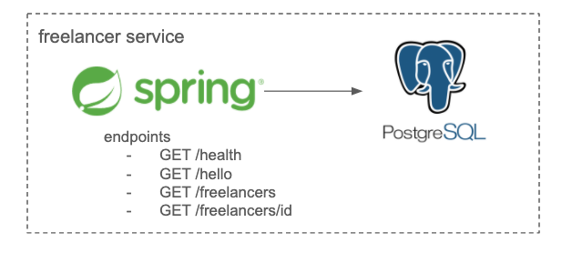

Pipeline practice sample.  
Implementation: Spring Boot, PostgreSQL



## How to develop on local device
```
// Start PostgreSQL with Docker
$ docker run --name my-pg -e POSTGRES_PASSWORD=password -e POSTGRES_DB=freelancerdb_test -d -p 5432:5432 postgres:9.4

// Connect PostgreSQL and load data
// You can load test data by using etc/testdata.sql
$ docker run -it --rm --link my-pg:db postgres:9.4 psql -h db -U postgres -d freelancerdb_test
postgres=# CREATE TABLE freelancer (freelancer_id character varying(255) PRIMARY KEY, first_name character varying(255), last_name character varying(255), email character varying(255), skills text[]);
postgres=# INSERT INTO freelancer (freelancer_id, first_name, last_name, email, skills) values ('1', 'Ken', 'Yasuda', 'ken.yasuda@example.com', '{ "ruby", "php", "mysql"}');
postgres=# INSERT INTO freelancer (freelancer_id, first_name, last_name, email, skills) values ('2', 'Tadashi', 'Komiya', 'tadashi.komiya@example.com', '{ "c#", "windows", "sqlserver"}');
postgres=# INSERT INTO freelancer (freelancer_id, first_name, last_name, email, skills) values ('3', 'Taro', 'Goto', 'taro.goto@example.com', '{ "ruby", "postgresql", "java"}');

// Test
$ mvn clean test
```

## Functions
| Method | Endpoint |
:-----------|:------------|
 GET | /freelancers |
 GET | /freelancers/{freelancerId} |

 ```
$ export FREELANCER_URL=http://$(oc get route freelancer-service -n $FREELANCER4J_PRJ -o template --template='{{.spec.host}}')

$ curl -X GET "$FREELANCER_URL/freelancers"
[
  {
    "freelancerId": "1",
    "firstName": "Ken",
    "lastName": "Yasuda",
    "email": "ken.yasuda@example.com",
    "skills": [
      "ruby",
      "php",
      "mysql"
    ]
  },
  {
    "freelancerId": "2",
    "firstName": "Tadashi",
    "lastName": "Komiya",
    "email": "tadashi.komiya@example.com",
    "skills": [
      "c#",
      "windows",
      "sqlserver"
    ]
  },
  {
    "freelancerId": "3",
    "firstName": "Taro",
    "lastName": "Goto",
    "email": "taro.goto@example.com",
    "skills": [
      "ruby",
      "postgresql",
      "java"
    ]
  }
]


$ curl -X GET "$FREELANCER_URL/freelancers/1"
{
  "freelancerId": "1",
  "firstName": "Ken",
  "lastName": "Yasuda",
  "email": "ken.yasuda@example.com",
  "skills": [
    "ruby",
    "php",
    "mysql"
  ]
}
 ```

## How to deploy OpenShift by Jenkins pipeline
See [this document](how-to-use.md).
